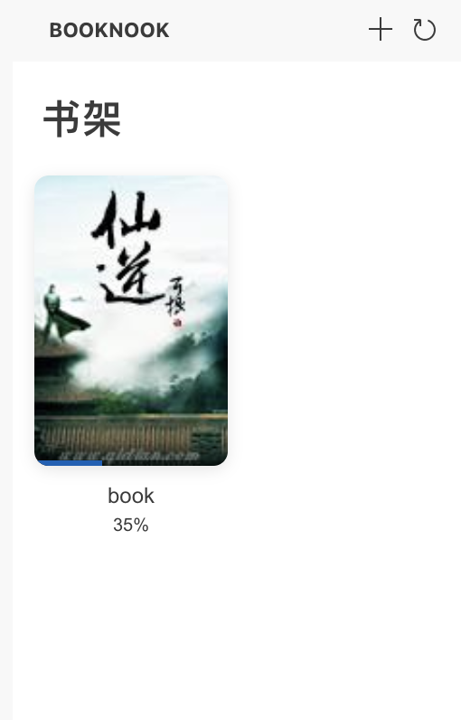
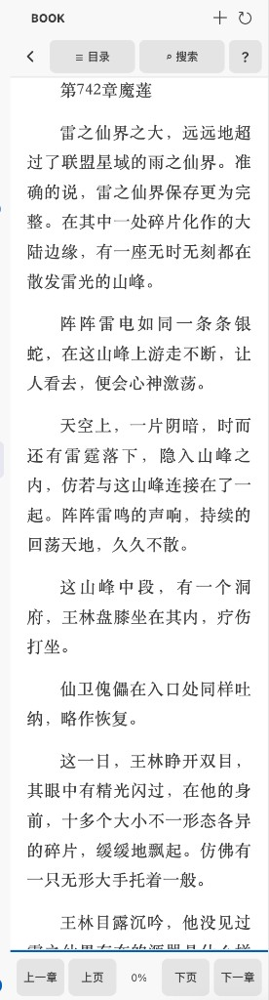

# BookNook 读书角 / BookNook Reader

[English](#english) · [中文](#中文)

---

## 中文

在 **VS Code** / **Cursor** 侧边栏阅读本地 **EPUB**、**TXT**，支持书架管理与阅读进度记忆。

### 截图

| 书架 | 阅读 |
|------|------|
|  |  |

### 功能

- **书架**：双列封面网格，显示阅读进度，支持导入、移除、刷新
- **阅读**：目录、全文搜索、章节切换、翻页，适配 VS Code 主题
- **进度记忆**：自动保存滚动位置与章节（EPUB 支持 CFI 精确定位）
- **TXT 编码**：自动检测 UTF-8、GBK 等常见编码
- **阅读位置**：可在侧边栏或主编辑区打开（设置项可切换）
- 导入书籍会**复制到扩展私有目录**，移动原文件不影响书架

### 快速开始

1. 安装扩展后，点击 Activity Bar 的 **BookNook** 图标
2. 点击 **+** 导入 `.epub` 或 `.txt` 文件
3. 点击书籍封面开始阅读

### 配置

| 配置项 | 说明 | 默认值 |
|--------|------|--------|
| `booknook.readerLocation` | `sidebar`（侧边栏）或 `editor`（主编辑区） | `sidebar` |
| `booknook.fontSize` | 正文字号（px） | `16` |
| `booknook.lineHeight` | 行高倍数 | `1.8` |

### 命令

- `BookNook: 导入书籍`
- `BookNook: 打开书籍`
- `BookNook: 从书架移除`
- `BookNook: 返回书架`
- `BookNook: 刷新书架`
- `BookNook: 切换阅读区位置（侧边栏 / 编辑区）`

### 快捷键（阅读界面）

| 按键 | 功能 |
|------|------|
| `←` / `→` | 上一章 / 下一章 |
| `PgUp` / `PgDn` | 上页 / 下页 |
| `Space` | 下页 |
| `T` | 打开目录 |
| `Ctrl+F` | 全文搜索 |
| `Esc` | 关闭面板 |

### 反馈

- [GitHub Issues](https://github.com/LukeLiou/book-nook/issues)

### 开发

```bash
npm install
npm run compile
# F5 启动扩展开发宿主
```

### 许可证

[MIT](LICENSE)

---

## English

Read local **EPUB** and **TXT** files inside **VS Code** / **Cursor** with a bookshelf and automatic progress sync.

### Screenshots

| Bookshelf | Reader |
|-----------|--------|
|  |  |

### Features

- **Bookshelf**: cover grid with progress, import, remove, and refresh
- **Reader**: table of contents, full-text search, chapter navigation, page turns, theme-aware UI
- **Progress sync**: saves scroll position and chapter (CFI for EPUB)
- **TXT encoding**: auto-detects UTF-8, GBK, and other common encodings
- **Reader location**: sidebar panel or main editor area (configurable)
- Imported books are **copied to the extension storage**; moving the original file does not break the shelf

### Quick Start

1. Open the **BookNook** icon in the Activity Bar
2. Click **+** to import an `.epub` or `.txt` file
3. Click a cover to start reading

### Settings

| Setting | Description | Default |
|---------|-------------|---------|
| `booknook.readerLocation` | `sidebar` or `editor` | `sidebar` |
| `booknook.fontSize` | Body font size (px) | `16` |
| `booknook.lineHeight` | Line height multiplier | `1.8` |

### Commands

- `BookNook: Import Book`
- `BookNook: Open Book`
- `BookNook: Remove from Bookshelf`
- `BookNook: Back to Bookshelf`
- `BookNook: Refresh Bookshelf`
- `BookNook: Toggle Reader Location (Sidebar / Editor)`

### Reader Shortcuts

| Key | Action |
|-----|--------|
| `←` / `→` | Previous / next chapter |
| `PgUp` / `PgDn` | Previous / next page |
| `Space` | Next page |
| `T` | Table of contents |
| `Ctrl+F` | Search |
| `Esc` | Close panel |

### Feedback

- [GitHub Issues](https://github.com/LukeLiou/book-nook/issues)

### Development

```bash
npm install
npm run compile
# Press F5 to launch Extension Development Host
```

### License

[MIT](LICENSE)
